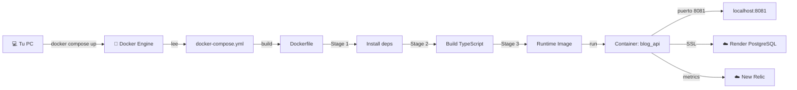
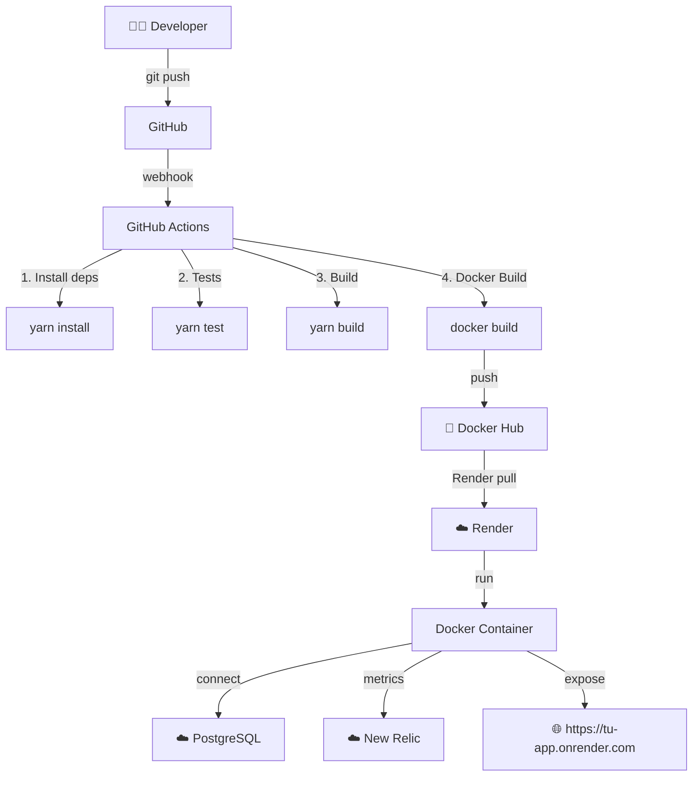

# 🐳 FLUJO COMPLETO: DOCKERFILE Y DOCKER COMPOSE

## 📋 **ÍNDICE**
1. [Dockerfile: Construcción de la Imagen](#dockerfile-construccion)
2. [Docker Compose: Orquestación](#docker-compose-orquestacion)
3. [Flujo Completo: Local vs. Render](#flujo-completo)
4. [Casos de Uso](#casos-de-uso)

---

## 🏗️ **1. DOCKERFILE: CONSTRUCCIÓN DE LA IMAGEN**

### **¿Qué hace el Dockerfile?**
Crea una **imagen Docker optimizada** de tu aplicación usando **multi-stage build**.

### **Multi-Stage Build: 3 Etapas**

```dockerfile
# ============================================
# ETAPA 1: INSTALACIÓN DE DEPENDENCIAS
# ============================================
FROM node:20-alpine AS deps
WORKDIR /app
COPY package*.json yarn.lock* ./
RUN yarn install --frozen-lockfile

# 📦 RESULTADO: Carpeta node_modules completa
# ⏱️ TIEMPO: ~1-2 minutos
# 💾 TAMAÑO: ~200-300 MB
```

**¿Por qué esta etapa?**
- ✅ Instala todas las dependencias (production + dev)
- ✅ Usa `--frozen-lockfile` para instalación determinística
- ✅ Cachea node_modules para builds más rápidas

```dockerfile
# ============================================
# ETAPA 2: COMPILACIÓN (TypeScript → JavaScript)
# ============================================
FROM node:20-alpine AS builder
WORKDIR /app
COPY --from=deps /app/node_modules ./node_modules
COPY . .
RUN yarn build   # Ejecuta: tsc

# 🔨 RESULTADO: Carpeta /dist con código compilado
# ⏱️ TIEMPO: ~30 segundos
# 📁 OUTPUT: src/*.ts → dist/*.js
```

**¿Qué hace `yarn build`?**
```json
// package.json
{
  "scripts": {
    "build": "tsc"  // TypeScript Compiler
  }
}
```

**Resultado del build:**
```
src/
├── server.ts      →  dist/server.js
├── db.ts          →  dist/db.js
├── controller/    →  dist/controller/
├── routes/        →  dist/routes/
└── model/         →  dist/model/
```

```dockerfile
# ============================================
# ETAPA 3: IMAGEN FINAL DE RUNTIME
# ============================================
FROM node:20-alpine AS runner
WORKDIR /app

# Copia solo lo necesario para producción
COPY --from=builder /app/package*.json ./
COPY --from=builder /app/node_modules ./node_modules
COPY --from=builder /app/dist ./dist
COPY --from=builder /app/newrelic.js ./

EXPOSE 8081

CMD ["node", "dist/server.js"]

# 🚀 RESULTADO: Imagen optimizada lista para ejecutar
# 💾 TAMAÑO FINAL: ~150-200 MB (vs 500+ MB sin multi-stage)
# 📦 CONTENIDO: Solo producción (sin archivos .ts, tests, etc.)
```

**¿Por qué multi-stage build?**
| Sin Multi-Stage | Con Multi-Stage |
|----------------|-----------------|
| ~500-600 MB | ~150-200 MB |
| Incluye archivos .ts | Solo archivos .js |
| Incluye devDependencies | Solo dependencies |
| Lento | Rápido |

---

## 🎼 **2. DOCKER COMPOSE: ORQUESTACIÓN**

### **¿Qué hace Docker Compose?**
**Orquesta** la ejecución de contenedores, facilitando el deployment local.

### **Archivo: docker-compose.yml**

```yaml
version: "3.8"

services:
  api:
    # ============================================
    # CONSTRUCCIÓN
    # ============================================
    build: .
    # Ejecuta: docker build -t blog-api:latest .
    # Usa el Dockerfile en el directorio actual
    
    # ============================================
    # CONFIGURACIÓN DEL CONTENEDOR
    # ============================================
    container_name: blog_api
    # Nombre fácil de identificar: docker ps mostrará "blog_api"
    
    # ============================================
    # NETWORKING
    # ============================================
    ports:
      - "8081:8081"
    # Puerto HOST:CONTAINER
    # localhost:8081 → container:8081
    
    # ============================================
    # VARIABLES DE ENTORNO
    # ============================================
    env_file:
      - .env
    # Carga automáticamente:
    # - DATABASE_URL (Render PostgreSQL)
    # - NEW_RELIC_LICENSE_KEY
    # - NEW_RELIC_APP_NAME
    # - NODE_ENV
```

---

## 🔄 **3. FLUJO COMPLETO: LOCAL vs. RENDER**

### **ESCENARIO 1: EJECUCIÓN LOCAL CON DOCKER COMPOSE**



#### **Comandos Paso a Paso:**

```powershell
# PASO 1: Construir imagen y levantar contenedor
docker compose up -d

# Lo que hace internamente:
# 1. Lee docker-compose.yml
# 2. Ejecuta Dockerfile (3 etapas)
# 3. Crea contenedor "blog_api"
# 4. Mapea puerto 8081
# 5. Carga variables .env
# 6. Ejecuta: node dist/server.js
# 7. App conecta a Render PostgreSQL (DATABASE_URL)
# 8. New Relic empieza a monitorear
```

#### **Salida del servidor:**
```bash
🚀 Server started on port 8081
🌍 Environment: development
Connection Successful
✅ Database Connected Successfully
```

#### **Probar la API:**
```powershell
# Health Check
Invoke-RestMethod -Uri "http://localhost:8081/api/healthchecker" -Method GET

# Response:
{
  "status": "success",
  "message": "CRUD Blog API - DevOps Stack...",
  "environment": "development",
  "timestamp": "2025-11-08T12:00:00.000Z"
}
```

#### **Logs del contenedor:**
```powershell
# Ver logs en tiempo real
docker logs blog_api -f

# Ver últimas 50 líneas
docker logs blog_api --tail 50
```

#### **Detener y limpiar:**
```powershell
# Detener contenedor
docker compose down

# Detener y eliminar volúmenes
docker compose down -v

# Rebuild completo (sin cache)
docker compose build --no-cache
docker compose up -d
```

---

### **ESCENARIO 2: DEPLOYMENT EN RENDER**



#### **¿Cómo ejecuta Render el Dockerfile?**

1. **Render detecta el Dockerfile** en tu repo
2. **Ejecuta el build** (igual que local):
   ```bash
   docker build -t blog-api:latest .
   ```
3. **Crea el contenedor**:
   ```bash
   docker run -p 10000:8081 \
     -e DATABASE_URL="postgresql://..." \
     -e NEW_RELIC_LICENSE_KEY="..." \
     -e PORT=10000 \
     blog-api:latest
   ```
4. **Render asigna puerto dinámicamente** (por eso necesitas `process.env.PORT`)
5. **Expone URL pública** con HTTPS automático

#### **Diferencias clave:**

| Aspecto | Local (Docker Compose) | Render (Cloud) |
|---------|----------------------|----------------|
| **Puerto** | 8081 (fijo) | 10000+ (dinámico) |
| **URL** | localhost:8081 | https://tu-app.onrender.com |
| **HTTPS** | ❌ No | ✅ Automático |
| **Variables** | Desde .env local | Desde Render Dashboard |
| **PostgreSQL** | ☁️ Render (conexión remota) | ☁️ Render (misma región) |
| **Escalabilidad** | 1 contenedor | Auto-scaling |

---

## 🎯 **4. CASOS DE USO**

### **CASO 1: Desarrollo Local**

```powershell
# Trabajar sin Docker (hot reload)
yarn start

# Trabajar con Docker (simula producción)
docker compose up -d
docker logs blog_api -f
```

**¿Cuándo usar cada uno?**
- **`yarn start`**: Desarrollo rápido, hot reload
- **`docker compose up`**: Probar comportamiento en producción

---

### **CASO 2: Testing en Contenedor**

```powershell
# Build de imagen
docker compose build

# Ejecutar tests dentro del contenedor
docker compose run api yarn test

# Ejecutar comando específico
docker compose run api yarn test:coverage
```

---

### **CASO 3: Deploy Manual desde Docker Hub**

```powershell
# Pull de imagen desde Docker Hub
docker pull fedemarty/blog-api:latest

# Ejecutar manualmente
docker run -d \
  --name blog_api \
  -p 8081:8081 \
  --env-file .env \
  fedemarty/blog-api:latest

# Verificar
curl http://localhost:8081/api/healthchecker
```

---

### **CASO 4: Debugging de Contenedor**

```powershell
# Entrar al contenedor
docker exec -it blog_api sh

# Dentro del contenedor:
ls -la                    # Ver archivos
cat dist/server.js        # Ver código compilado
node --version            # Versión de Node
npm list                  # Dependencias instaladas
printenv                  # Variables de entorno
exit                      # Salir
```

---

## 📊 **COMPARACIÓN DE FLUJOS**

### **Flujo 1: Docker Compose (Local)**

```
┌────────────────────────────────────────────────────────────┐
│                    EJECUCIÓN LOCAL                         │
├────────────────────────────────────────────────────────────┤
│                                                            │
│  💻 TU PC                                                  │
│  ┌──────────────────────────────────────┐                 │
│  │  docker compose up                   │                 │
│  └──────────┬───────────────────────────┘                 │
│             │                                              │
│             ▼                                              │
│  ┌──────────────────────────────────────┐                 │
│  │  Dockerfile (multi-stage)            │                 │
│  │  ├─ deps                             │                 │
│  │  ├─ builder                          │                 │
│  │  └─ runner                           │                 │
│  └──────────┬───────────────────────────┘                 │
│             │                                              │
│             ▼                                              │
│  ┌──────────────────────────────────────┐                 │
│  │  Container: blog_api                 │                 │
│  │  Port: localhost:8081                │                 │
│  └──────────┬───────────────────────────┘                 │
│             │                                              │
│             ├────────────────────────────┐                 │
│             │                            │                 │
│             ▼                            ▼                 │
│  ┌──────────────────┐        ┌──────────────────┐         │
│  │ ☁️ Render        │        │ ☁️ New Relic     │         │
│  │ PostgreSQL       │        │ APM              │         │
│  └──────────────────┘        └──────────────────┘         │
└────────────────────────────────────────────────────────────┘
```

### **Flujo 2: Render (Cloud)**

```
┌────────────────────────────────────────────────────────────┐
│                  EJECUCIÓN EN RENDER                       │
├────────────────────────────────────────────────────────────┤
│                                                            │
│  👨‍💻 Developer                                             │
│  ┌──────────────────────────────────────┐                 │
│  │  git push origin main                │                 │
│  └──────────┬───────────────────────────┘                 │
│             │                                              │
│             ▼                                              │
│  ┌──────────────────────────────────────┐                 │
│  │  GitHub Actions (CI/CD)              │                 │
│  │  ├─ Tests                            │                 │
│  │  ├─ Build                            │                 │
│  │  └─ Docker Push                      │                 │
│  └──────────┬───────────────────────────┘                 │
│             │                                              │
│             ▼                                              │
│  ┌──────────────────────────────────────┐                 │
│  │  Docker Hub                          │                 │
│  │  fedemarty/blog-api:latest           │                 │
│  └──────────┬───────────────────────────┘                 │
│             │                                              │
│             ▼                                              │
│  ☁️ RENDER CLOUD                                          │
│  ┌──────────────────────────────────────┐                 │
│  │  docker run (automático)             │                 │
│  │  ├─ Pull image                       │                 │
│  │  ├─ Set env vars                     │                 │
│  │  └─ Expose HTTPS                     │                 │
│  └──────────┬───────────────────────────┘                 │
│             │                                              │
│             ▼                                              │
│  ┌──────────────────────────────────────┐                 │
│  │  🌐 https://tu-app.onrender.com      │                 │
│  │  Port: 10000 (dinámico)              │                 │
│  └──────────┬───────────────────────────┘                 │
│             │                                              │
│             ├────────────────────────────┐                 │
│             │                            │                 │
│             ▼                            ▼                 │
│  ┌──────────────────┐        ┌──────────────────┐         │
│  │ ☁️ Render        │        │ ☁️ New Relic     │         │
│  │ PostgreSQL       │        │ APM              │         │
│  └──────────────────┘        └──────────────────┘         │
└────────────────────────────────────────────────────────────┘
```

---

## 🔍 **DIFERENCIAS CLAVE**

### **Docker Compose vs. Render**

| Característica | Docker Compose | Render |
|----------------|----------------|--------|
| **Trigger** | Manual: `docker compose up` | Automático: git push |
| **Build** | Local en tu PC | En servidores de Render |
| **Variables .env** | Archivo local `.env` | Dashboard de Render |
| **Puerto** | Fijo: 8081 | Dinámico: process.env.PORT |
| **URL** | localhost:8081 | https://tu-app.onrender.com |
| **SSL/HTTPS** | No | Sí (automático) |
| **Escalabilidad** | 1 contenedor | Auto-scaling |
| **Logs** | `docker logs` | Render Dashboard |
| **Monitoreo** | New Relic (manual) | New Relic (integrado) |

---

## 💡 **RESUMEN**

### **El flujo completo es:**

1. **Desarrollo**: Escribes código en TypeScript
2. **Build Local**: `yarn build` compila a JavaScript
3. **Dockerfile**: Crea imagen optimizada (3 etapas)
4. **Docker Compose**: Ejecuta localmente para testing
5. **Git Push**: Subes cambios a GitHub
6. **GitHub Actions**: Tests + Build + Docker Push
7. **Render**: Detecta cambios, pull de imagen, deploy automático
8. **Producción**: App viva en URL pública con HTTPS

### **Componentes que NO cambian:**
- ✅ PostgreSQL: Siempre en Render (tanto local como producción)
- ✅ New Relic: Siempre monitoreando
- ✅ Dockerfile: Mismo archivo para local y producción

### **Lo que cambia:**
- 🔄 Puerto: 8081 (local) vs dinámico (Render)
- 🔄 URL: localhost vs https://tu-app.onrender.com
- 🔄 Variables: .env local vs Render Dashboard

---

**¡Ahora entiendes el flujo completo! 🚀**
